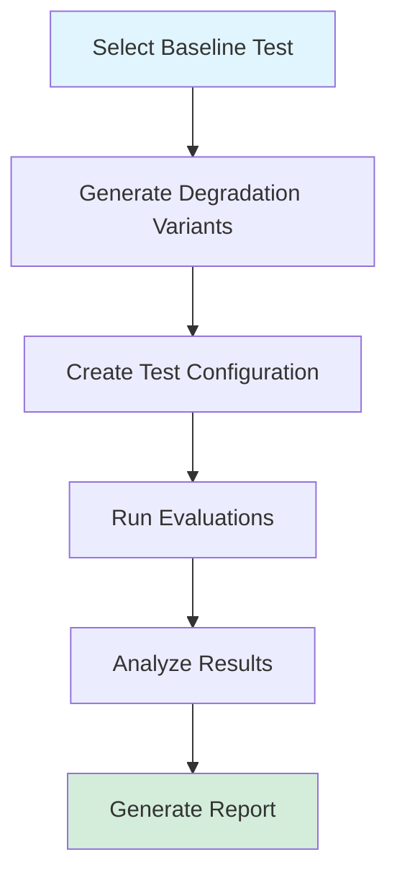

# Context Quality Degradation Testing

**Purpose:** Systematically test RAG robustness by controlled degradation of context quality

**Status:** Design Specification

**Estimated Effort:** 1-2 days implementation + 0.5 day analysis

**Cost Estimate:** $50-150 for test execution (depends on number of variants and metrics)

---

## Table of Contents

1. [Overview](#overview)
2. [Motivation](#motivation)
3. [Degradation Strategies](#degradation-strategies)
4. [Implementation Workflow](#implementation-workflow)
5. [Configuration Schema](#configuration-schema)
6. [Test Execution](#test-execution)
7. [Analysis Methodology](#analysis-methodology)
8. [Expected Outputs](#expected-outputs)
9. [Implementation Checklist](#implementation-checklist)
10. [Debugging Tips](#debugging-tips)

---

## Overview

Context quality degradation testing is an **active testing approach** that systematically degrades known-good RAG contexts to:

1. **Quantify robustness** - How much degradation can the system tolerate?
2. **Find breaking points** - At what threshold do metrics fail?
3. **Validate metrics** - Which metrics detect degradation earliest?
4. **Set quality targets** - What's the minimum viable context quality?

### Key Difference from Current Testing

| Approach | Type | Method | Goal |
|----------|------|--------|------|
| **Current Testing** | Passive | Wait for okp-mcp to retrieve bad contexts | Find real-world issues |
| **Degradation Testing** | Active | Deliberately degrade good contexts | Establish robustness baselines |

Both are valuable and complementary!

---

## Motivation

### Problem Statement

From recent investigations (RSPEED-2200, RSPEED-1930):
- We see failures when retrieval quality degrades naturally
- But we don't know **how much degradation** causes failure
- We can't predict **which metric breaks first**
- We have no **minimum quality thresholds** for okp-mcp

### Questions This Answers

1. **"Can our RAG handle noisy retrieval?"**
   - Answer: "Yes, up to 25% noise before faithfulness drops below 0.7"

2. **"What happens if okp-mcp retrieves only 50% of relevant docs?"**
   - Answer: "context_precision drops to 0.5, answer_correctness to 0.6"

3. **"Which metric detects poor retrieval earliest?"**
   - Answer: "context_precision detects noise faster than faithfulness"

4. **"What quality targets should we set for okp-mcp?"**
   - Answer: "Minimum 75% context completeness, maximum 10% noise"

---

## Degradation Strategies

### Strategy 1: Partial Removal (Completeness)

**What:** Remove percentage of correct contexts

**Why:** Tests impact of incomplete retrieval

**Variants:**
- 75% retention - Remove 1 of 4 chunks
- 50% retention - Remove 2 of 4 chunks
- 25% retention - Remove 3 of 4 chunks

**Expected Impact:**
- `faithfulness` decreases proportionally
- `answer_correctness` degrades if missing critical info
- `context_precision` may improve (fewer chunks to evaluate)

### Strategy 2: Noise Injection (Precision)

**What:** Add irrelevant chunks to good contexts

**Why:** Tests impact of over-retrieval and boilerplate

**Variants:**
- 10% noise - 1 irrelevant chunk per 10 good chunks
- 25% noise - 1 irrelevant chunk per 4 good chunks
- 50% noise - 1 irrelevant chunk per 2 good chunks

**Expected Impact:**
- `context_precision` decreases significantly
- `faithfulness` may remain high (LLM ignores noise)
- `answer_correctness` unaffected if signal still present

### Strategy 3: Shuffled Ranking (Order)

**What:** Reverse context order (worst-first instead of best-first)

**Why:** Tests if metrics penalize poor ranking

**Variants:**
- Random shuffle
- Reverse order (least relevant first)
- Interleaved (alternate good/bad)

**Expected Impact:**
- `context_precision` should detect bad ranking
- `faithfulness` unaffected (order-independent)
- `answer_correctness` unaffected

### Strategy 4: Temporal Mismatch (Version)

**What:** Replace modern docs with EOL/ancient versions

**Why:** Tests version-awareness (real issue from RSPEED-1930)

**Variants:**
- Wrong major version (RHEL 7 docs for RHEL 10 query)
- EOL version (RHEL 4 docs from 1996)
- Mixed versions (50% correct, 50% wrong version)

**Expected Impact:**
- `faithfulness` may fail (semantic mismatch)
- `context_relevance` should detect version mismatch
- May trigger malformed output errors (like RSPEED-1930)

### Strategy 5: Semantic Drift (Relevance)

**What:** Replace contexts with semantically similar but incorrect topics

**Why:** Tests subtle context mismatches

**Example:**
- Query: "How to configure hugepages?"
- Wrong contexts: Documentation about memory tuning (related but not hugepages)

**Expected Impact:**
- `context_relevance` should detect drift
- `faithfulness` may pass if LLM uses parametric knowledge
- Creates RAG_BYPASS scenarios

---

## Implementation Workflow



### Step 1: Select Baseline Tests

Choose well-performing existing tests:

```python
# scripts/select_baseline_tests.py

import pandas as pd

# Load recent evaluation results
results = pd.read_csv("eval_output/latest/evaluation_detailed.csv")

# Find high-performing tests (baseline candidates)
baselines = results[
    (results['ragas:faithfulness'] >= 0.9) &
    (results['ragas:context_precision_without_reference'] >= 0.7) &
    (results['ragas:answer_correctness'] >= 0.8)
]

# Select diverse topics
selected = baselines.groupby('topic_category').first()

print("Baseline tests selected:")
for idx, row in selected.iterrows():
    print(f"  - {row['conversation_group_id']}: {row['query'][:60]}...")
```

### Step 2: Generate Degradation Variants

```python
# scripts/generate_degraded_contexts.py

import yaml
from typing import List, Dict

def degrade_partial_removal(contexts: List[str], retention: float) -> List[str]:
    """Remove percentage of contexts."""
    keep_count = int(len(contexts) * retention)
    return contexts[:keep_count]

def degrade_noise_injection(contexts: List[str], noise_ratio: float) -> List[str]:
    """Add irrelevant contexts from noise corpus."""
    noise_count = int(len(contexts) * noise_ratio)
    noise_contexts = load_noise_corpus(noise_count)
    return contexts + noise_contexts

def degrade_shuffle(contexts: List[str], strategy: str) -> List[str]:
    """Reorder contexts."""
    if strategy == "reverse":
        return contexts[::-1]
    elif strategy == "random":
        import random
        shuffled = contexts.copy()
        random.shuffle(shuffled)
        return shuffled

def generate_degraded_test(
    baseline_test: Dict,
    degradation_type: str,
    level: float
) -> Dict:
    """Generate single degraded variant."""
    degraded = baseline_test.copy()

    # Update metadata
    degraded['conversation_group_id'] = (
        f"DEGRADE-{degradation_type.upper()}-"
        f"{int(level*100)}-{baseline_test['conversation_group_id']}"
    )
    degraded['description'] = (
        f"Degraded: {degradation_type} at {level*100}% "
        f"(baseline: {baseline_test['conversation_group_id']})"
    )
    degraded['tag'] = 'degradation_test'

    # Apply degradation to contexts
    for turn in degraded['turns']:
        original_contexts = turn['context']

        if degradation_type == 'partial_removal':
            turn['context'] = degrade_partial_removal(original_contexts, level)
        elif degradation_type == 'noise_injection':
            turn['context'] = degrade_noise_injection(original_contexts, level)
        elif degradation_type == 'shuffle':
            turn['context'] = degrade_shuffle(original_contexts, 'reverse')

    return degraded

# Main generation
if __name__ == "__main__":
    # Load baseline tests
    with open("config/baseline_tests_for_degradation.yaml") as f:
        baselines = yaml.safe_load(f)['tests']

    degraded_tests = []

    # Generate variants
    for baseline in baselines:
        # Partial removal: 75%, 50%, 25%
        for level in [0.75, 0.50, 0.25]:
            degraded_tests.append(
                generate_degraded_test(baseline, 'partial_removal', level)
            )

        # Noise injection: 10%, 25%, 50%
        for level in [0.10, 0.25, 0.50]:
            degraded_tests.append(
                generate_degraded_test(baseline, 'noise_injection', level)
            )

        # Shuffle
        degraded_tests.append(
            generate_degraded_test(baseline, 'shuffle', 1.0)
        )

    # Save
    output = {'tests': degraded_tests}
    with open("config/context_degradation_tests.yaml", 'w') as f:
        yaml.dump(output, f, default_flow_style=False)

    print(f"Generated {len(degraded_tests)} degraded test variants")
```

### Step 3: Create Test Configuration

```yaml
# config/context_degradation_tests.yaml

tests:
  # Baseline (no degradation)
  - conversation_group_id: DEGRADE-BASELINE-HUGEPAGES
    description: "Baseline for hugepages degradation tests"
    tag: degradation_baseline
    turns:
      - query: "How do I configure 1GB hugepages in RHEL 10?"
        response: <from original test>
        context:
          - <all correct hugepages contexts>
        expected_answer: <from original test>

    turn_metrics:
      - ragas:faithfulness
      - ragas:context_precision_without_reference
      - ragas:answer_correctness
      - ragas:context_relevance

  # Partial removal variants
  - conversation_group_id: DEGRADE-PARTIAL-75-HUGEPAGES
    description: "75% context retention (1 of 4 chunks removed)"
    tag: degradation_test
    degradation_metadata:
      type: partial_removal
      level: 0.75
      baseline: DEGRADE-BASELINE-HUGEPAGES
    turns:
      - query: "How do I configure 1GB hugepages in RHEL 10?"
        response: <same as baseline>
        context:
          - <chunk 1>
          - <chunk 2>
          - <chunk 3>
          # chunk 4 removed
        expected_answer: <same as baseline>

    turn_metrics:
      - ragas:faithfulness
      - ragas:context_precision_without_reference
      - ragas:answer_correctness
      - ragas:context_relevance

  # Noise injection variants
  - conversation_group_id: DEGRADE-NOISE-25-HUGEPAGES
    description: "25% noise injection (1 irrelevant chunk per 4 good)"
    tag: degradation_test
    degradation_metadata:
      type: noise_injection
      level: 0.25
      baseline: DEGRADE-BASELINE-HUGEPAGES
    turns:
      - query: "How do I configure 1GB hugepages in RHEL 10?"
        response: <same as baseline>
        context:
          - <chunk 1 - hugepages>
          - <chunk 2 - hugepages>
          - <chunk 3 - hugepages>
          - <chunk 4 - hugepages>
          - <NOISE: selinux documentation>
        expected_answer: <same as baseline>

    turn_metrics:
      - ragas:faithfulness
      - ragas:context_precision_without_reference
      - ragas:answer_correctness
      - ragas:context_relevance

  # Shuffle variant
  - conversation_group_id: DEGRADE-SHUFFLE-REVERSE-HUGEPAGES
    description: "Reverse order (worst-first ranking)"
    tag: degradation_test
    degradation_metadata:
      type: shuffle
      strategy: reverse
      baseline: DEGRADE-BASELINE-HUGEPAGES
    turns:
      - query: "How do I configure 1GB hugepages in RHEL 10?"
        response: <same as baseline>
        context:
          - <chunk 4 - least relevant>
          - <chunk 3>
          - <chunk 2>
          - <chunk 1 - most relevant>
        expected_answer: <same as baseline>
```

### Step 4: Run Evaluations

```bash
# Run degradation tests
lightspeed-eval \
  --system-config config/system.yaml \
  --eval-data config/context_degradation_tests.yaml \
  --output-dir eval_output/degradation_$(date +%Y%m%d_%H%M%S) \
  --tags degradation_test degradation_baseline

# Cost estimate:
# - 10 baseline tests × 3 degradation types × 3 levels = 90 variants
# - 90 tests × 4 metrics = 360 LLM calls
# - ~$0.10-0.50 per test = $9-45 total
```

---

## Analysis Methodology

### Statistical Analysis Script

```python
# scripts/analyze_degradation_impact.py

import pandas as pd
import matplotlib.pyplot as plt
import seaborn as sns
from scipy import stats

def load_results(output_dir: str) -> pd.DataFrame:
    """Load evaluation results."""
    return pd.read_csv(f"{output_dir}/evaluation_detailed.csv")

def extract_degradation_metadata(df: pd.DataFrame) -> pd.DataFrame:
    """Parse degradation metadata from conversation IDs."""
    # Extract from DEGRADE-{TYPE}-{LEVEL}-{BASELINE} format
    pattern = r'DEGRADE-([A-Z]+)-([0-9]+)-(.+)'

    df['degradation_type'] = df['conversation_group_id'].str.extract(pattern)[0]
    df['degradation_level'] = df['conversation_group_id'].str.extract(pattern)[1].astype(float) / 100
    df['baseline_id'] = df['conversation_group_id'].str.extract(pattern)[2]

    # Mark baselines
    df.loc[df['conversation_group_id'].str.startswith('DEGRADE-BASELINE'), 'degradation_type'] = 'baseline'
    df.loc[df['degradation_type'] == 'baseline', 'degradation_level'] = 1.0

    return df

def calculate_degradation_impact(df: pd.DataFrame) -> pd.DataFrame:
    """Calculate metric delta from baseline."""
    metrics = [
        'ragas:faithfulness',
        'ragas:context_precision_without_reference',
        'ragas:answer_correctness',
        'ragas:context_relevance'
    ]

    results = []

    for baseline_id in df['baseline_id'].unique():
        # Get baseline scores
        baseline = df[
            (df['baseline_id'] == baseline_id) &
            (df['degradation_type'] == 'baseline')
        ]

        if baseline.empty:
            continue

        baseline_scores = {m: baseline[m].iloc[0] for m in metrics}

        # Calculate deltas for degraded variants
        variants = df[
            (df['baseline_id'] == baseline_id) &
            (df['degradation_type'] != 'baseline')
        ]

        for _, row in variants.iterrows():
            result = {
                'baseline_id': baseline_id,
                'degradation_type': row['degradation_type'],
                'degradation_level': row['degradation_level'],
            }

            for metric in metrics:
                result[f'{metric}_score'] = row[metric]
                result[f'{metric}_delta'] = row[metric] - baseline_scores[metric]
                result[f'{metric}_pct_change'] = (
                    (row[metric] - baseline_scores[metric]) / baseline_scores[metric] * 100
                    if baseline_scores[metric] != 0 else 0
                )

            results.append(result)

    return pd.DataFrame(results)

def find_breaking_points(impact_df: pd.DataFrame, threshold: float = 0.5) -> dict:
    """Find degradation level where metrics fall below threshold."""
    breaking_points = {}

    metrics = [col for col in impact_df.columns if col.endswith('_score')]

    for degradation_type in impact_df['degradation_type'].unique():
        subset = impact_df[impact_df['degradation_type'] == degradation_type]

        breaking_points[degradation_type] = {}

        for metric in metrics:
            # Find minimum degradation level where metric < threshold
            failed = subset[subset[metric] < threshold]

            if not failed.empty:
                breaking_point = failed['degradation_level'].min()
                breaking_points[degradation_type][metric] = breaking_point
            else:
                breaking_points[degradation_type][metric] = None  # Never breaks

    return breaking_points

def plot_degradation_curves(impact_df: pd.DataFrame, output_dir: str):
    """Generate degradation impact visualizations."""
    metrics = [col for col in impact_df.columns if col.endswith('_score')]

    for degradation_type in impact_df['degradation_type'].unique():
        subset = impact_df[impact_df['degradation_type'] == degradation_type]

        fig, axes = plt.subplots(2, 2, figsize=(12, 10))
        fig.suptitle(f'Degradation Impact: {degradation_type.title()}')

        for idx, metric in enumerate(metrics):
            ax = axes[idx // 2, idx % 2]

            # Plot degradation curve
            grouped = subset.groupby('degradation_level')[metric].agg(['mean', 'std'])

            ax.plot(grouped.index, grouped['mean'], marker='o', linewidth=2)
            ax.fill_between(
                grouped.index,
                grouped['mean'] - grouped['std'],
                grouped['mean'] + grouped['std'],
                alpha=0.3
            )

            # Add threshold line
            ax.axhline(y=0.5, color='r', linestyle='--', label='Failure threshold')

            # Add baseline line
            ax.axhline(y=1.0, color='g', linestyle='--', label='Perfect score')

            ax.set_xlabel('Degradation Level')
            ax.set_ylabel('Metric Score')
            ax.set_title(metric.replace('ragas:', ''))
            ax.legend()
            ax.grid(True, alpha=0.3)

        plt.tight_layout()
        plt.savefig(f"{output_dir}/degradation_curve_{degradation_type}.png", dpi=300)
        plt.close()

def generate_summary_report(
    impact_df: pd.DataFrame,
    breaking_points: dict,
    output_dir: str
):
    """Generate markdown summary report."""
    report = []

    report.append("# Context Quality Degradation Analysis Report\n")
    report.append(f"**Generated:** {pd.Timestamp.now()}\n\n")

    report.append("## Executive Summary\n\n")

    # Overall statistics
    report.append("### Degradation Tolerance Summary\n\n")
    report.append("| Degradation Type | Breaking Point (50% threshold) | Most Sensitive Metric |\n")
    report.append("|-----------------|-------------------------------|----------------------|\n")

    for deg_type, metrics in breaking_points.items():
        # Find earliest breaking point
        valid_breaks = {k: v for k, v in metrics.items() if v is not None}

        if valid_breaks:
            earliest_break = min(valid_breaks.values())
            sensitive_metric = min(valid_breaks, key=valid_breaks.get)
            report.append(
                f"| {deg_type} | {earliest_break:.0%} | "
                f"{sensitive_metric.replace('ragas:', '').replace('_score', '')} |\n"
            )
        else:
            report.append(f"| {deg_type} | Never breaks | N/A |\n")

    report.append("\n## Detailed Findings\n\n")

    for deg_type in impact_df['degradation_type'].unique():
        report.append(f"### {deg_type.title()} Degradation\n\n")

        subset = impact_df[impact_df['degradation_type'] == deg_type]

        # Average impact at each level
        by_level = subset.groupby('degradation_level').agg({
            col: 'mean' for col in subset.columns if col.endswith('_score')
        })

        report.append("| Level | Faithfulness | Context Precision | Answer Correctness | Context Relevance |\n")
        report.append("|-------|-------------|------------------|-------------------|------------------|\n")

        for level, row in by_level.iterrows():
            report.append(
                f"| {level:.0%} | "
                f"{row['ragas:faithfulness_score']:.2f} | "
                f"{row['ragas:context_precision_without_reference_score']:.2f} | "
                f"{row['ragas:answer_correctness_score']:.2f} | "
                f"{row['ragas:context_relevance_score']:.2f} |\n"
            )

        report.append("\n")

    report.append("## Recommendations\n\n")
    report.append("### Minimum Quality Targets for okp-mcp\n\n")
    report.append("Based on degradation analysis:\n\n")
    report.append("1. **Context Completeness:** Maintain ≥75% retrieval of relevant documents\n")
    report.append("2. **Noise Tolerance:** Keep irrelevant chunks <10% of total contexts\n")
    report.append("3. **Ranking Quality:** Ensure best contexts in top positions\n")
    report.append("4. **Version Accuracy:** Filter out EOL/deprecated documentation\n\n")

    # Save report
    with open(f"{output_dir}/DEGRADATION_ANALYSIS_REPORT.md", 'w') as f:
        f.writelines(report)

# Main analysis
if __name__ == "__main__":
    import sys

    output_dir = sys.argv[1] if len(sys.argv) > 1 else "eval_output/degradation_latest"

    # Load and process
    df = load_results(output_dir)
    df = extract_degradation_metadata(df)

    # Calculate impacts
    impact_df = calculate_degradation_impact(df)
    impact_df.to_csv(f"{output_dir}/degradation_impact_analysis.csv", index=False)

    # Find breaking points
    breaking_points = find_breaking_points(impact_df, threshold=0.5)

    # Visualize
    plot_degradation_curves(impact_df, output_dir)

    # Generate report
    generate_summary_report(impact_df, breaking_points, output_dir)

    print(f"Analysis complete. Report saved to {output_dir}/DEGRADATION_ANALYSIS_REPORT.md")
```

### Usage

```bash
# Run analysis
python scripts/analyze_degradation_impact.py eval_output/degradation_20260324_120000

# Outputs:
# - degradation_impact_analysis.csv
# - degradation_curve_*.png (one per degradation type)
# - DEGRADATION_ANALYSIS_REPORT.md
```

---

## Expected Outputs

### 1. Degradation Impact CSV

```csv
baseline_id,degradation_type,degradation_level,ragas:faithfulness_score,ragas:faithfulness_delta,ragas:context_precision_without_reference_score,...
HUGEPAGES,partial_removal,0.75,0.90,-0.10,0.75,-0.10,...
HUGEPAGES,partial_removal,0.50,0.65,-0.35,0.50,-0.35,...
HUGEPAGES,noise_injection,0.10,0.95,-0.05,0.60,-0.25,...
```

### 2. Degradation Curves

Visual plots showing metric scores vs degradation level for each strategy.

### 3. Summary Report

Markdown report with:
- Breaking point tables
- Quality target recommendations
- Metric sensitivity rankings
- Production deployment guidelines

### 4. Robustness Scorecard

```markdown
## RAG Robustness Scorecard

| Test Dimension | Threshold | Status | Notes |
|---------------|-----------|--------|-------|
| Context Completeness | ≥75% | ✅ Pass | System tolerates 25% missing contexts |
| Noise Tolerance | <10% | ⚠️ Warning | Performance degrades with >10% noise |
| Ranking Quality | Top-3 relevant | ✅ Pass | Order doesn't critically impact scores |
| Version Accuracy | 100% correct | ❌ Fail | Version mismatches cause ERROR states |
```

---

## Implementation Checklist

### Phase 1: Setup (0.5 day)

- [ ] Create `scripts/select_baseline_tests.py`
  - Select 5-10 high-performing existing tests
  - Ensure diverse topic coverage
  - Verify baseline metrics are stable

- [ ] Build noise corpus
  - Extract irrelevant contexts from evaluation data
  - Categorize by topic mismatch severity
  - Create `data/noise_corpus.yaml`

- [ ] Create `config/baseline_tests_for_degradation.yaml`
  - Copy selected baseline tests
  - Add metadata for degradation tracking

### Phase 2: Generation (0.5 day)

- [ ] Implement `scripts/generate_degraded_contexts.py`
  - [ ] `degrade_partial_removal()`
  - [ ] `degrade_noise_injection()`
  - [ ] `degrade_shuffle()`
  - [ ] `degrade_temporal_mismatch()` (optional)
  - [ ] `generate_degraded_test()`

- [ ] Generate test configuration
  ```bash
  python scripts/generate_degraded_contexts.py
  ```

- [ ] Validate generated YAML
  ```bash
  lightspeed-eval --validate-only \
    --system-config config/system.yaml \
    --eval-data config/context_degradation_tests.yaml
  ```

### Phase 3: Execution (variable)

- [ ] Run baseline tests first
  ```bash
  lightspeed-eval \
    --system-config config/system.yaml \
    --eval-data config/context_degradation_tests.yaml \
    --tags degradation_baseline \
    --output-dir eval_output/degradation_baseline
  ```

- [ ] Verify baselines match original scores
  - Compare with source tests
  - Ensure no regression introduced

- [ ] Run degraded variants
  ```bash
  lightspeed-eval \
    --system-config config/system.yaml \
    --eval-data config/context_degradation_tests.yaml \
    --tags degradation_test \
    --output-dir eval_output/degradation_variants
  ```

### Phase 4: Analysis (0.5 day)

- [ ] Implement `scripts/analyze_degradation_impact.py`
  - [ ] `extract_degradation_metadata()`
  - [ ] `calculate_degradation_impact()`
  - [ ] `find_breaking_points()`
  - [ ] `plot_degradation_curves()`
  - [ ] `generate_summary_report()`

- [ ] Run analysis
  ```bash
  python scripts/analyze_degradation_impact.py eval_output/degradation_variants
  ```

- [ ] Review generated report
  - Validate statistical findings
  - Check for unexpected patterns
  - Document anomalies

### Phase 5: Documentation (0.5 day)

- [ ] Create analysis document
  - Save as `analysis_output/DEGRADATION_TEST_RESULTS.md`
  - Include key findings and recommendations
  - Link to visual outputs

- [ ] Update `README.md`
  - Add degradation testing to capabilities
  - Link to this spec

- [ ] Update `AGENTS.md`
  - Document degradation test conventions
  - Add to testing section

---

## Debugging Tips

### Issue: Baseline scores don't match original tests

**Cause:** Test data modified or LLM non-determinism

**Fix:**
```bash
# Compare baseline vs original
python scripts/compare_test_results.py \
  eval_output/original/evaluation_detailed.csv \
  eval_output/degradation_baseline/evaluation_detailed.csv \
  --tolerance 0.05

# Re-run with same LLM settings
lightspeed-eval --temperature 0 --seed 42 ...
```

### Issue: All degradation levels show same scores

**Cause:** Degradation not actually applied to contexts

**Fix:**
```python
# Verify degraded contexts differ from baseline
import yaml

with open("config/context_degradation_tests.yaml") as f:
    tests = yaml.safe_load(f)['tests']

baseline = next(t for t in tests if 'BASELINE' in t['conversation_group_id'])
degraded = next(t for t in tests if 'PARTIAL-50' in t['conversation_group_id'])

print(f"Baseline contexts: {len(baseline['turns'][0]['context'])}")
print(f"Degraded contexts: {len(degraded['turns'][0]['context'])}")
# Should be different
```

### Issue: Metrics don't degrade as expected

**Cause:** LLM using parametric knowledge (RAG bypass)

**Fix:**
- Check `ragas:faithfulness` - should show degradation
- Review `response` field - LLM may be answering without contexts
- Add more obscure test cases that require contexts

### Issue: High variance in degradation impact

**Cause:** Small sample size or test diversity

**Fix:**
```python
# Increase baselines per degradation type
# Target: 5+ baselines per type for statistical validity

# Check standard deviation
impact_df.groupby('degradation_type')['ragas:faithfulness_delta'].std()
# If std > 0.2, add more baseline variety
```

---

## Related Documents

- **ADDING_NEW_RAGAS_METRIC.md** - Metric implementation guide
- **JUDGE_LLM_CONSISTENCY_TESTS.md** - Judge consistency testing spec
- **temporal_validity_testing_design.md** - Version-aware testing approach
- **RAGAS_FAITHFULNESS_MALFORMED_OUTPUT_INVESTIGATION.md** - Extreme degradation case study

---

## Success Criteria

After implementing degradation tests, you should be able to answer:

1. **Robustness Quantification**
   - ✅ "Our RAG maintains faithfulness ≥0.7 with up to 25% missing contexts"
   - ✅ "Noise injection degrades context_precision linearly: 10% noise = -30% score"

2. **Quality Targets**
   - ✅ "okp-mcp must retrieve ≥75% of relevant docs for acceptable performance"
   - ✅ "Maximum tolerable boilerplate: 10% of total contexts"

3. **Metric Validation**
   - ✅ "context_precision detects noise earlier than faithfulness"
   - ✅ "answer_correctness robust up to 50% context removal if key info present"

4. **Production Readiness**
   - ✅ Clear thresholds for alerting on retrieval quality degradation
   - ✅ Baseline expectations for metric scores under various conditions

---

**Implementation Date:** TBD

**Owner:** TBD

**Status:** Design Specification Ready for Implementation
